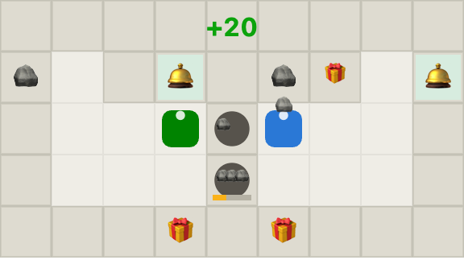

# FACET · Human-Compatible Multiplayer Agents

**FACET (Fictitious Agent Co-training for Emergent Teamwork)** is a
lightweight population-based reinforcement-learning method for training
*multiplayer agents that cooperate with humans*, not just with copies of
themselves — research by [Jewel Labs](https://jewellabs.org).

The testbed is the Overcooked benchmark rendered as a **diamond atelier**
(Jewel Labs' domain): two workers fetch rough stones 🪨, load three into a
cutting wheel, and deliver the finished diamond 💎 at the client counter
(+20 per delivery). Only the skin is ours — dynamics, layouts, and the
human dataset are the unmodified benchmark, so all numbers stay comparable
to the Overcooked literature.

📄 **Paper:** [`paper/facet.pdf`](paper/facet.pdf) ·
🕹️ **Live demo:** replay trained agents in your browser ·
🧠 **Models:** all 75 trained checkpoints in [`models/`](models/)

<p align="center"></p>

## TL;DR

Self-play RL agents develop private conventions that break when their
partner is a human. FACET trains a best response to a **prioritized
population** of

1. **behavior-cloned human models** (fit on the real 2019 Overcooked
   human–human dataset — 103,141 timesteps of human gameplay), and
2. **frozen self-play checkpoints** at four skill stages (à la Fictitious
   Co-Play),

sampling hardest-to-coordinate-with partners more often.

**Measured findings** (all numbers from this repo's runs, one M4 laptop):

- Self-play loses **53–96%** of its self-paired score when paired with
  held-out human proxies — the classic Overcooked result, reproduced.
- **PPO_BC** (best response to one human model) is the strongest
  human-proxy method on 3/5 layouts — but it pays on the machine-partner
  axis, and two copies of it even **deadlock at score 0** with each other
  on two layouts.
- **FACET** is the only method with no catastrophic cell on any
  layout × partner-type combination (worst cell 12.7 vs 3.7–5.8 for the
  baselines) and has the best combined human+fleet score
  (110.3 vs 102.0 PPO_BC / 95.0 SP / 43.3 BC).

## Repository layout

```
src/facet/        training stack: PPO (3 partner modes), BC, vec envs, pools
scripts/          CLIs: train_ppo.py, evaluate.py, analyze.py, record_trajs.py
models/           all trained checkpoints (BC, SP, PPO_BC, FACET × 5 layouts × 3 seeds)
results/          raw evaluation episodes + aggregated summary
paper/            LaTeX source + figures + compiled PDF
docs/             GitHub Pages demo (canvas replay of trained agents)
vendor/           pinned Overcooked-AI benchmark (env + human data)
```

## Reproduce everything

Requires Python 3.12 and ~6 hours on a 10-core laptop (no GPU needed).

```bash
python3.12 -m venv .venv && .venv/bin/pip install torch numpy pandas matplotlib tqdm \
    gymnasium dill scipy pygame ipython ipywidgets opencv-python-headless
git clone --depth 1 https://github.com/HumanCompatibleAI/overcooked_ai vendor/overcooked_ai
export PYTHONPATH=src:vendor/overcooked_ai/src

# 1. human data -> BC datasets + BC models (~25 min)
.venv/bin/python -m facet.data data/bc
.venv/bin/python -m facet.bc data/bc models/bc

# 2. RL suite: self-play, then best-response methods (~5 h)
scripts/run_batch.sh scripts/queue_sp.txt 4
scripts/run_batch.sh scripts/queue_br.txt 4

# 3. evaluation (human-proxy + fleet), tables, figures, demo data
for L in cramped_room asymmetric_advantages coordination_ring random0 random3; do
  .venv/bin/python scripts/evaluate.py --layout $L
  .venv/bin/python scripts/eval_fleet.py --layout $L
done
.venv/bin/python scripts/analyze.py results
.venv/bin/python scripts/analyze.py fleet
.venv/bin/python scripts/analyze.py figures
.venv/bin/python scripts/record_trajs.py --layouts cramped_room asymmetric_advantages \
    coordination_ring random0 random3
```

## Method in one equation

Each parallel environment holds a frozen partner *i* drawn from

```
p_i ∝ ε/N + (1−ε) · softmax(−R̄_i / τ)
```

where `R̄_i` is a min-max–normalized EMA of the sparse return the learner
currently achieves with partner *i* (τ = 0.35, ε = 0.25, EMA β = 0.05).
Partners are re-sampled every episode; the learner trains with vanilla PPO
on its own transitions only. That's the whole method.

## Citation

```bibtex
@article{kandukoori2026facet,
  title   = {FACET: Prioritized Population-Based Reinforcement Learning
             for Human-Compatible Multiplayer Agents},
  author  = {Kandukoori, Aditya and Kandukoori, Aarush and
             Jariwala, Soham and Wasi, Khandaker},
  journal = {Jewel Labs Research},
  year    = {2026},
  url     = {https://jewellabs.org}
}
```

Built on the [Overcooked-AI](https://github.com/HumanCompatibleAI/overcooked_ai)
benchmark and human dataset (Carroll et al., NeurIPS 2019). MIT license.
